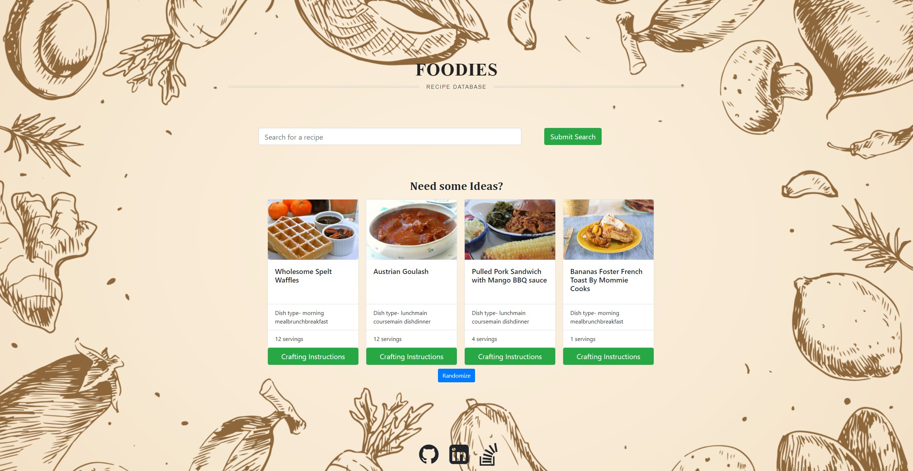

# Foodies

  
  

## Descripton
An application that allows the user to search for food recipes using the third party spoonacular API. The application will have a short summary as well as steps to complete the recipe.
Link to deployed application can be found here http://chazgraham.github.io/Foodies

## Table of Contents
  * [Installation Instructions](#installation-instructions)
  * [Application Usage](#application-usage)
  * [Contributors](#contributors)
  * [Licenses](#licenses)
  * [Tests](#tests)
  * [Contact Me](#contact-me)

## Installation Instructions
Before running this application you must install -Please run `npm i` in the files root, cleint, and server directories.

## Application Usage
The application is used to help the user that is unfamiliar with the recipe they want to make and will give them step by step instructions.

## Contributors
By Chaz Graham

## Licenses
This application is licensed under: ISC

## Tests
To test application open the console and run the following comand: No testing at this time.

## Contact Me
If you have additional questions you can contact me at https://github.com/chazgraham or by Emailing me at chazhg80.cg@gmail.com